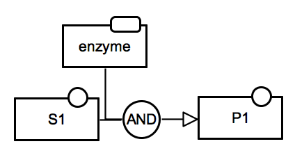
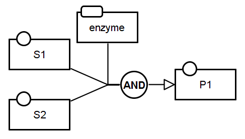
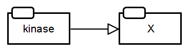
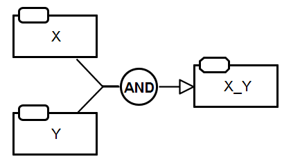
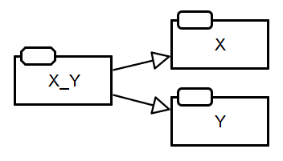
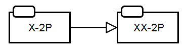
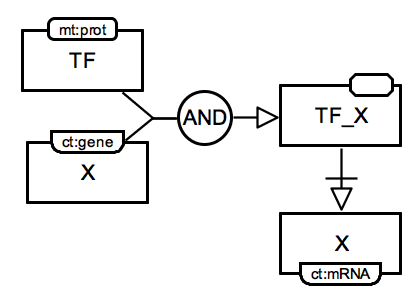
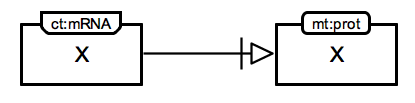

# Activity Flow Bricks

This page presents a collection of Activity Flow bricks. 

## Metabolic network

<table>
    <tr>
    <td style="width:210px; text-align:center; font-size:90%;"> <a href="/bricks/reaction/Reaction-AF01.01-IRR.sbgn">SBGN-ML</a> </td>
    <td style="vertical-align: middle; padding-left: 1em;"><strong>Irreversible reaction.</strong> The activities of the enzyme and the substrate (S1) transform into the activity of the product (P1), shown by the use of the <i>positive influence</i> arc. Both substrate and product activities are marked by the <i>simple chemical</i> unit of information. The enzyme activity is represented using the <i>macromolecule</i> unit of information. <i>Logic arcs</i> resulting in the logical operator <i>AND</i> represent the necessity of the combined activities of S1 and enzyme.</td>
    </tr>
    <tr>
    <td style="width:210px; text-align:center; font-size:90%;"> <a href="/bricks/reaction/Reaction-AF02.01-IRR.sbgn">SBGN-ML</a> </td>
    <td style="vertical-align: middle; padding-left: 1em;"><strong>Irreversible reaction: multiple substrates.</strong>  The activities of the enzyme and two substrate (S1 and S2) transform into the activity of the product (P1). All substrate and product activities are marked by the <i>simple chemical</i> unit of information. The enzyme activity is represented using the <i>macromolecule</i> unit of information. <i>Logic arcs</i> resulting in the logical operator <i>AND</i> represent the necessity of the combined activities of S1, S2 and enzyme.</td>
    </tr>
</table>

## Signalling network

<table>
    <tr>
   	<td style="width:210px; text-align:center; font-size:90%;"> <a href="/bricks/proteinphosphorylation/ProteinPhosphorylation-AF01.01-hz.sbgn">SBGN-ML</a> </td>
    <td style="vertical-align: middle; padding-left: 1em;"><strong>Protein phosphorylation.</strong> The kinase activity positively influences the activity of a phosphorylated protein X. Both activities are marked by the <i>macromolecule</i> unit of information. If the phosphorylation leaded to protein deactivation, then the <i>activation</i> arc would have been replaced by an <i>inhibition</i> arc.</td>
    </tr>
	<tr>
    <td style="width:210px; text-align:center; font-size:90%;"> <a href="/bricks/complexassociation/ComplexFormation-AF01.AA.sbgn">SBGN-ML</a> </td>
    <td style="vertical-align: middle; padding-left: 1em;"><strong>Complex association.</strong> The activity X together with the activity Y stimulates the activity X_Y. The identity of X_Y as a complex is represented using the <i>complex</i> unit of information. </td>
    </tr>
   	<tr>
    <td style="width:210px; text-align:center; font-size:90%;"> <a href="/bricks/complexdissociation/ComplexDissociation-AF01.AA.sbgn">SBGN-ML</a> </td>
    <td style="vertical-align: middle; padding-left: 1em;"><strong>Complex dissociation.</strong> The activity X_Y stimulates the activities X and Y. </td>
    </tr>
    <tr>
    <td style="width:210px; text-align:center; font-size:90%;"> <a href="/bricks/oligomerisation/Homodimerisation-AF01.AA.sbgn">SBGN-ML</a> </td>
    <td style="vertical-align: middle; padding-left: 1em;"><strong>Oligomerisation.</strong> The activity of X-2P stimulates the activity of XX-2P. Both activities are phosphorylated at two residues (indicated by suffix <i>-2P</i> in the label). Cardinality cannot be represented in AF, thus the process of homodimerization is indicated by the labels <i>X-2P</i> and <i>XX-2P</i>. </td>
    </tr>
</table>

## Gene regulatory network

<table>
	<tr>
	<td style="width:210px; text-align:center; font-size:90%;"> <a href="/bricks/generegulation/Transcription-AF01-AA.sbgn">SBGN-ML</a> </td>
    <td style="vertical-align: middle; padding-left: 1em;"><strong>Direct regulation of a target gene by a transcription factor.</strong> The activities of a transcription factor (TF) and its target gene (TG) DNA X form a complex TF-X indicating the experimentally verified promoter binding of the TF. The complex identity of TF-X is represented using the <i>complex</i> unit of information. This complex is necessary to stimulate the activity of the TG mRNA X as indicated by the <i>neccessary stimulation</i> connecting arc. The identities of genomic fragment of DNA or RNA as <i>nucleic acid features</i> is represented by the shape of the unit of information and the conceptual types (<i>ct:gene</i>, <i>ct:mRNA</i>) as label in the unit of information. </td>
   	</tr>
   	<tr>
   	<td style="width:210px; text-align:center; font-size:90%;"> <a href="/bricks/generegulation/Translation-AF01-AA.sbgn">SBGN-ML</a> </td>
    <td style="vertical-align: middle; padding-left: 1em;"><strong>Translation.</strong> The activity of X with the <i>nucleic acid feature</i> unit of information with the conceptual type <i>mRNA</i> (ct:mRNA) is necessary to  stimulate the activity X with the <i>macromolecule</i> unit of information and the material type <i>protein</i> (mt:prot).</td>
	</tr>	
</table>

