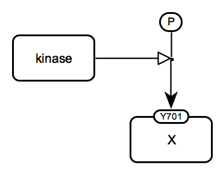

# SBGN Bricks Dictionary

The previous version of the dictionary is available at [http://sbgnbricks.sourceforge.net](http://sbgnbricks.sourceforge.net/sbgnbricks_dictionary.html).

[Metabolic reaction](#metabolic-reaction)  
[Catalysis](#catalysis)  
[Protein phosphorylation](#protein-phosphorylation)  
[Inhition](#inhibition)

## Metabolism

### Metabolic reaction 
Associated GO terms: [GO:0008152 metabolic process](http://amigo.geneontology.org/amigo/term/GO:0008152)

### Catalysis 
Associated GO terms: [GO:0003824 catalytic activity](http://amigo.geneontology.org/amigo/term/GO:0003824)

### Inhibition
Associated GO terms: [GO:0043086 negative regulation of catalytic activity](http://amigo.geneontology.org/amigo/term/GO:0043086)

## Signalling

### Protein phosphorylation
Associated GO terms: [GO:0006468 protein phosphorylation](http://amigo.geneontology.org/amigo/term/GO:0006468)

<table>
    <tr>
    <td style="width:260px; text-align:center; font-size:90%;"> <a href="/bricks/proteinphosphorylation/ProteinPhosphorylation-PD01.03-2x2.sbgn">SBGN-ML</a></td>
    <td style="width:260px; text-align:center; font-size:90%;"> <a href="/bricks/proteinphosphorylation/ProteinPhosphorylation-AF01.01.sbgn">SBGN-ML</a></td>
    <td style="width:260px; text-align:center; font-size:90%;"> <a href="/bricks/proteinphosphorylation/ProteinPhosphorylation-ER01.01.sbgn">SBGN-ML</a></td>
    </tr>
</table>

