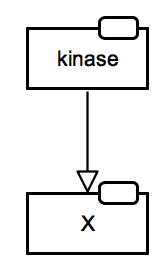

# SBGN Bricks Dictionary

The previous version of the dictionary is available at [http://sbgnbricks.sourceforge.net](http://sbgnbricks.sourceforge.net/sbgnbricks_dictionary.html){:target="_blank"}.

[Metabolic reaction](#metabolic-reaction)  
[Catalysis](#catalysis)  
[Protein phosphorylation](#protein-phosphorylation)  
[Inhition](#inhibition)

## Metabolism

### Metabolic reaction 

Associated GO terms: [GO:0008152 metabolic process](http://amigo.geneontology.org/amigo/term/GO:0008152)

### Catalysis 

Associated GO terms: [GO:0003824 catalytic activity](http://amigo.geneontology.org/amigo/term/GO:0003824)

### Inhibition

Associated GO terms: [GO:0043086 negative regulation of catalytic activity](http://amigo.geneontology.org/amigo/term/GO:0043086)

## Signalling

### Protein phosphorylation

Associated GO terms: [GO:0006468 protein phosphorylation](http://amigo.geneontology.org/amigo/term/GO:0006468); [GO:0001934 positive regulation of protein phosphorylation](http://amigo.geneontology.org/amigo/term/GO:0001934); [GO:0032147 activation of protein kinase activity](http://amigo.geneontology.org/amigo/term/GO:0032147)

<table>
    <tr>
    <td style="width:260px; text-align:center; font-size:90%;"> <a href="/bricks/proteinphosphorylation/ProteinPhosphorylation-PD01-2x2.sbgn">SBGN-ML</a></td>
    <td style="width:260px; text-align:center; font-size:90%;"> <a href="/bricks/proteinphosphorylation/ProteinPhosphorylation-AF01.sbgn">SBGN-ML</a></td>
    <td style="width:260px; text-align:center; font-size:90%;"> <a href="/bricks/proteinphosphorylation/ProteinPhosphorylation-ER01.sbgn">SBGN-ML</a></td>
    </tr>
</table>

For the AF expression the assumption is that the phosporylation leads to the activity towards another entity (not shown). A different possible situation: phosphorylation leads to protein deactivation and then the _activation_ arc in AF would need to be replaced by _inhibition_ arc.

In a similar way other types of posttranslational modifications can be expressed:  

Acetylation | &nbsp; &nbsp; Ac | &nbsp; &nbsp; SBO:0000215 | &nbsp; &nbsp; &nbsp; &nbsp; &nbsp; &nbsp; &nbsp; &nbsp; Palmytoylation | &nbsp; &nbsp; Pa | &nbsp; &nbsp; SBO:0000218  
Glycosylation | &nbsp; &nbsp; G | &nbsp; &nbsp; SBO:0000217 | &nbsp; &nbsp; &nbsp; &nbsp; &nbsp; &nbsp; &nbsp; &nbsp; Prenylation | &nbsp; &nbsp; Pr | &nbsp; &nbsp; SBO:0000221  
Hydroxylation | &nbsp; &nbsp; OH | &nbsp; &nbsp; SBO:0000233 | &nbsp; &nbsp; &nbsp; &nbsp; &nbsp; &nbsp; &nbsp; &nbsp;  Protonation | &nbsp; &nbsp; H | &nbsp; &nbsp; SBO:0000212  
Methylation | &nbsp; &nbsp; Me | &nbsp; &nbsp; SBO:0000214 | &nbsp; &nbsp; &nbsp; &nbsp; &nbsp; &nbsp; &nbsp; &nbsp; Sulfation | &nbsp; &nbsp; S | &nbsp; &nbsp; SBO:0000220  
Myristoylation | &nbsp; &nbsp; My | &nbsp; &nbsp; SBO:0000219 | &nbsp; &nbsp; &nbsp; &nbsp; &nbsp; &nbsp; &nbsp; &nbsp; Ubiquitination | &nbsp; &nbsp; Ub | &nbsp; &nbsp; SBO:0000224  

 
