

# SBGN Bricks Dictionary

The previous version of the dictionary is available at <a href = "http://sbgnbricks.sourceforge.net/sbgnbricks_dictionary.html" target="_blank">http://sbgnbricks.sourceforge.net</a>.

* [Metabolic network](#Metabolic-network)
    * [Metabolic reaction](#metabolic-reaction)
    * [Catalysis](#catalysis)
    * [Inhibition](#inhibition)
* [Signalling network](#signalling-network)
    * [Protein phosphorylation](#protein-phosphorylation)
    * [Oligomerisation](#oligomerisation)
    * [Complex association](#complex-association)
    * [Complex dissociation](#complex-dissociation)
* [Gene regulatory network](#gene-regulatory-network)
    * [Transcription](#transcription)
    * [Regulation of transcription by a transcription factor](#regulation-of-transcription-by-a-transcription-factor)
    * [Translation](#translation)
* [Transport](#transport)
    * [Passive transport](#passive-transport)
    * [Active transport](#active-transport)
* [Functional genomics](#functional-genomics)

## Metabolic network

### Metabolic reaction

Associated GO terms: [GO:0008152 metabolic process](http://amigo.geneontology.org/amigo/term/GO:0008152)

#### Irreversible reaction

<table class="dic">
  <tr>
      <td class="pd" style="width:32%">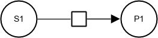</td>
      <td class="af" style="width:32%">Not applicable</td>
      <td class="er" style="width:32%">Not applicable</td>
  </tr>
  <tr>
      <td>&nbsp;&nbsp;&nbsp;&nbsp;&nbsp;</td>
      <td></td>
      <td></td>
  </tr>
</table>

#### Reversible reaction

<table class="dic">
  <tr>
      <td class="pd" style="width:32%">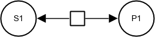</td>
      <td class="af" style="width:32%">Not applicable</td>
      <td class="er" style="width:32%">Not applicable</td>
  </tr>
  <tr>
      <td>&nbsp;&nbsp;&nbsp;&nbsp;&nbsp;</td>
      <td></td>
      <td></td>
  </tr>
</table>

### Catalysis

Associated GO terms: [GO:0003824 catalytic activity](http://amigo.geneontology.org/amigo/term/GO:0003824)

#### Irreversible reaction

<table class="dic">
  <tr>
      <td class="pd" style="width:32%">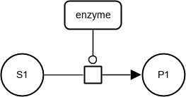</td>
      <td class="af del" style="width:32%"></td>
      <!-- <td class="af change" style="width:32%">Not applicable</td> -->
      <td class="er" style="width:32%">Not applicable</td>
  </tr>
  <tr>
      <td>&nbsp;&nbsp;&nbsp;&nbsp;&nbsp;</td>
      <td>&nbsp;&nbsp;&nbsp;&nbsp;&nbsp;</td>
      <!-- <td></td> -->
      <td></td>
  </tr>
</table>

#### Irreversible reaction with multiple substrates and products

<table class="dic">
  <tr>
      <td class="pd" style="width:32%">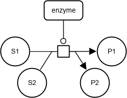</td>
      <td class="af del" style="width:32%"></td>
      <!-- <td class="af change" style="width:32%">Not applicable</td> -->
      <td class="er" style="width:32%">Not applicable</td>
  </tr>
  <tr>
      <td>&nbsp;&nbsp;&nbsp;&nbsp;&nbsp;</td>
      <td>&nbsp;&nbsp;&nbsp;&nbsp;&nbsp;</td>
      <!-- <td></td> -->
      <td></td>
  </tr>
</table>

#### Reversible reaction

<table class="dic">
  <tr>
      <td class="pd" style="width:32%">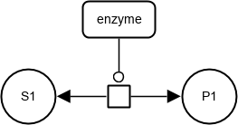</td>
      <td class="af" style="width:32%">Not applicable</td>
      <td class="er" style="width:32%">Not applicable</td>
  </tr>
  <tr>
      <td>&nbsp;&nbsp;&nbsp;&nbsp;&nbsp;</td>
      <td></td>
      <td></td>
  </tr>
</table>

#### Reversible reaction with multiple substrates and products

<table class="dic">
  <tr>
      <td class="pd" style="width:32%">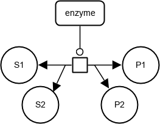</td>
      <td class="af" style="width:32%">Not applicable</td>
      <td class="er" style="width:32%">Not applicable</td>
  </tr>
  <tr>
      <td>&nbsp;&nbsp;&nbsp;&nbsp;&nbsp;</td>
      <td></td>
      <td></td>
  </tr>
</table>

### Inhibition

Associated GO terms: [GO:0043086 negative regulation of catalytic activity](http://amigo.geneontology.org/amigo/term/GO:0043086)

#### Irreversible reaction

<table class="dic">
  <tr>
      <td class="pd" style="width:32%">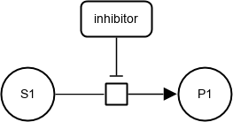</td>
      <td class="af" style="width:32%">Not applicable</td>
      <td class="er" style="width:32%">Not applicable</td>
  </tr>
  <tr>
      <td>&nbsp;&nbsp;&nbsp;&nbsp;&nbsp;</td>
      <td></td>
      <td></td>
  </tr>
</table>

#### Irreversible catalyzed reaction

<table class="dic">
  <tr>
      <td class="pd" style="width:32%">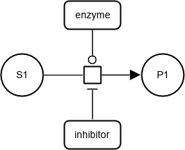</td>
      <td class="af" style="width:32%">Not applicable</td>
      <td class="er" style="width:32%">Not applicable</td>
  </tr>
  <tr>
      <td>&nbsp;&nbsp;&nbsp;&nbsp;&nbsp;</td>
      <td></td>
      <td></td>
  </tr>
</table>

#### Reversible catalyzed reaction

<table class="dic">
  <tr>
      <td class="pd" style="width:32%">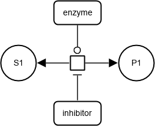</td>
      <td class="af" style="width:32%">Not applicable</td>
      <td class="er" style="width:32%">Not applicable</td>
  </tr>
  <tr>
      <td>&nbsp;&nbsp;&nbsp;&nbsp;&nbsp;</td>
      <td></td>
      <td></td>
  </tr>
</table>

#### Irreversible reaction

## Signalling network

Associated GO terms: [GO:0023052 signaling](http://amigo.geneontology.org/amigo/term/GO:0023052); [GO:0007165 signal transduction](http://amigo.geneontology.org/amigo/term/GO:0007165); [GO:0023051 regulation of signaling](http://amigo.geneontology.org/amigo/term/GO:0023051)

### Protein phosphorylation

Associated GO terms: [GO:0006468 protein phosphorylation](http://amigo.geneontology.org/amigo/term/GO:0006468); [GO:0001934 positive regulation of protein phosphorylation](http://amigo.geneontology.org/amigo/term/GO:0001934); [GO:0032147 activation of protein kinase activity](http://amigo.geneontology.org/amigo/term/GO:0032147)

<table class="dic">
  <tr>
      <td class="pd" style="width:32%">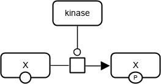</td>
      <td class="af" style="width:32%">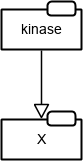</td>
      <td class="er new" style="width:32%">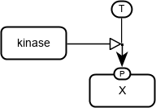</td>
  </tr>
  <tr>
      <td>&nbsp;&nbsp;&nbsp;&nbsp;&nbsp;</td>
      <td>&nbsp;&nbsp;&nbsp;&nbsp;&nbsp;</td>
      <td></td>
  </tr>
</table>

<table class="dic">
  <tr>
      <td class="pd" style="width:32%">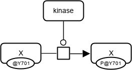</td>
      <td class="af" style="width:32%"></td>
      <td class="er" style="width:32%">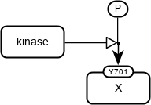</td>
  </tr>
  <tr>
      <td>&nbsp;&nbsp;&nbsp;&nbsp;&nbsp;</td>
      <td>&nbsp;&nbsp;&nbsp;&nbsp;&nbsp;</td>
      <td>&nbsp;&nbsp;&nbsp;&nbsp;&nbsp;</td>
  </tr>
</table>

<table class="dic">
  <tr>
      <td class="pd" style="width:32%">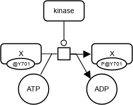</td>
      <td class="af" style="width:32%"></td>
      <td class="er" style="width:32%"></td>
  </tr>
  <tr>
      <td>&nbsp;&nbsp;&nbsp;&nbsp;&nbsp;</td>
      <td>&nbsp;&nbsp;&nbsp;&nbsp;&nbsp;</td>
      <td></td>
  </tr>
</table>

For the AF expression, the assumption is that phosporylation of X leads to its activation.
Phosphorylation could also lead to its deactivation, and then the *stimulation* arc in AF would need to be replaced by an *inhibition* arc.

In a similar way other types of post-translational modifications can be expressed:

Acetylation | &nbsp; &nbsp; Ac | &nbsp; &nbsp; SBO:0000215 | &nbsp; &nbsp; &nbsp; &nbsp; &nbsp; &nbsp; &nbsp; &nbsp; Palmytoylation | &nbsp; &nbsp; Pa | &nbsp; &nbsp; SBO:0000218
Glycosylation | &nbsp; &nbsp; G | &nbsp; &nbsp; SBO:0000217 | &nbsp; &nbsp; &nbsp; &nbsp; &nbsp; &nbsp; &nbsp; &nbsp; Prenylation | &nbsp; &nbsp; Pr | &nbsp; &nbsp; SBO:0000221
Hydroxylation | &nbsp; &nbsp; OH | &nbsp; &nbsp; SBO:0000233 | &nbsp; &nbsp; &nbsp; &nbsp; &nbsp; &nbsp; &nbsp; &nbsp;  Protonation | &nbsp; &nbsp; H | &nbsp; &nbsp; SBO:0000212
Methylation | &nbsp; &nbsp; Me | &nbsp; &nbsp; SBO:0000214 | &nbsp; &nbsp; &nbsp; &nbsp; &nbsp; &nbsp; &nbsp; &nbsp; Sulfation | &nbsp; &nbsp; S | &nbsp; &nbsp; SBO:0000220
Myristoylation | &nbsp; &nbsp; My | &nbsp; &nbsp; SBO:0000219 | &nbsp; &nbsp; &nbsp; &nbsp; &nbsp; &nbsp; &nbsp; &nbsp; Ubiquitination | &nbsp; &nbsp; Ub | &nbsp; &nbsp; SBO:0000224

### Protein dephosphorylation

<table class="dic">
  <tr>
      <td class="pd new" style="width:32%">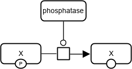</td>
      <td class="af new" style="width:32%">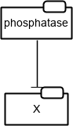</td>
      <td class="er new" style="width:32%">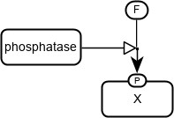</td>
  </tr>
  <tr>
      <td>&nbsp;&nbsp;&nbsp;&nbsp;&nbsp;</td>
      <td>&nbsp;&nbsp;&nbsp;&nbsp;&nbsp;</td>
      <td>&nbsp;&nbsp;&nbsp;&nbsp;&nbsp;</td>
  </tr>
</table>

<table class="dic">
  <tr>
      <td class="pd new" style="width:32%">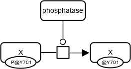</td>
      <td class="af new" style="width:32%"></td>
      <td class="er new" style="width:32%"></td>
  </tr>
  <tr>
      <td>&nbsp;&nbsp;&nbsp;&nbsp;&nbsp;</td>
      <td>&nbsp;&nbsp;&nbsp;&nbsp;&nbsp;</td>
      <td>&nbsp;&nbsp;&nbsp;&nbsp;&nbsp;</td>
  </tr>
</table>

<table class="dic">
  <tr>
      <td class="pd new" style="width:32%">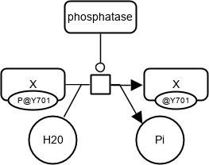</td>
      <td class="af new" style="width:32%"></td>
      <td class="er new" style="width:32%">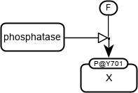</td>
  </tr>
  <tr>
      <td>&nbsp;&nbsp;&nbsp;&nbsp;&nbsp;</td>
      <td>&nbsp;&nbsp;&nbsp;&nbsp;&nbsp;</td>
      <td>&nbsp;&nbsp;&nbsp;&nbsp;&nbsp;</td>
  </tr>
</table>

For the AF expression, the assumption is that dephosporylation of X leads to its deactivation.
Dephosphorylation could also lead to its activation, and then the _inhibition_ arc in AF would need to be replaced by a *stimulation* arc.

### Oligomerisation

Associated GO terms: [GO:0051259 protein complex oligomerization](http://amigo.geneontology.org/amigo/term/GO:0051259)

<table class="dic">
  <tr>
      <td class="pd" style="width:32%">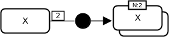</td>
      <td class="af change" style="width:32%">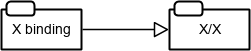</td>
      <td class="er new" style="width:32%">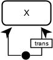</td>
  </tr>
  <tr>
      <td>&nbsp;&nbsp;&nbsp;&nbsp;&nbsp;</td>
      <td>&nbsp;&nbsp;&nbsp;&nbsp;&nbsp;</td>
      <td></td>
  </tr>
</table>

For the AF expression, the assumption is that the dimer X/X has some activity.

### Complex association

Associated GO terms: [GO:0065003 protein-containing complex assembly](http://amigo.geneontology.org/amigo/term/GO:0065003)

<table class="dic">
  <tr>
      <td class="pd" style="width:32%">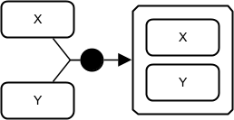</td>
      <td class="af change" style="width:32%">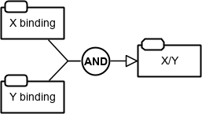</td>
      <td class="er change" style="width:32%"></td>
  </tr>
  <tr>
      <td>&nbsp;&nbsp;&nbsp;&nbsp;&nbsp;</td>
      <td>&nbsp;&nbsp;&nbsp;&nbsp;&nbsp;</td>
      <td>&nbsp;&nbsp;&nbsp;&nbsp;&nbsp;</td>
  </tr>
</table>

For the AF expression, the assumption is that the complex X/Y has some activity.

### Complex dissociation

Associated GO terms: [GO:0032984 protein-containing complex disassembly](http://amigo.geneontology.org/amigo/term/GO:0032984)

<table class="dic">
  <tr>
      <td class="pd" style="width:32%">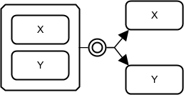</td>
      <td class="af del" style="width:32%"></td>
      <!-- <td class="af change" style="width:32%">Not applicable</td> -->
      <td class="er change" style="width:32%">Not applicable</td>
  </tr>
  <tr>
      <td>&nbsp;&nbsp;&nbsp;&nbsp;&nbsp;</td>
      <td>&nbsp;&nbsp;&nbsp;&nbsp;&nbsp;</td>
      <!-- <td></td> -->
      <td></td>
  </tr>
</table>

## Gene regulatory network

### Transcription

Associated GO terms: [GO:0006351 transcription, DNA-templated](http://amigo.geneontology.org/amigo/term/GO:0006351); [GO:0009299 mRNA transcription](http://amigo.geneontology.org/amigo/term/GO:0009299)

<table class="dic">
  <tr>
      <td class="pd new" style="width:32%">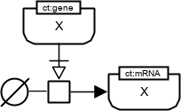</td>
      <td class="af new" style="width:32%">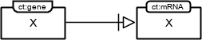</td>
      <td class="er new" style="width:32%">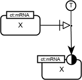</td>
  </tr>
  <tr>
      <td>&nbsp;&nbsp;&nbsp;&nbsp;&nbsp;</td>
      <td>&nbsp;&nbsp;&nbsp;&nbsp;&nbsp;</td>
      <td>&nbsp;&nbsp;&nbsp;&nbsp;&nbsp;</td>
  </tr>
</table>

### Regulation of transcription by a transcription factor

Associated GO terms: [GO:0006351 transcription, DNA-templated](http://amigo.geneontology.org/amigo/term/GO:0006351); [GO:0065004 protein-DNA complex assembly](http://amigo.geneontology.org/amigo/term/GO:0065004); [GO:0009299 mRNA transcription](http://amigo.geneontology.org/amigo/term/GO:0009299); [GO:0006355 regulation of transcription, DNA-templated](http://amigo.geneontology.org/amigo/term/GO:0097659)

<table class="dic">
  <tr>
      <td class="pd change" style="width:32%">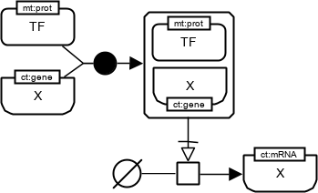</td>
      <td class="af change" style="width:32%">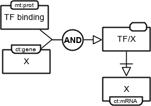</td>
      <td class="er" style="width:32%">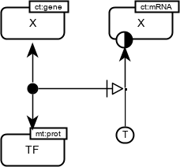</td>
  </tr>
  <tr>
      <td>&nbsp;&nbsp;&nbsp;&nbsp;&nbsp;</td>
      <td>&nbsp;&nbsp;&nbsp;&nbsp;&nbsp;</td>
      <td>&nbsp;&nbsp;&nbsp;&nbsp;&nbsp;</td>
  </tr>
</table>

### Translation

Associated GO terms: [GO:0006412 translation](http://amigo.geneontology.org/amigo/term/GO:0006412)

<table class="dic">
  <tr>
      <td class="pd change" style="width:32%"></td>
      <td class="af" style="width:32%">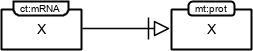</td>
      <td class="er" style="width:32%">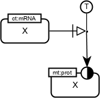</td>
  </tr>
  <tr>
      <td>&nbsp;&nbsp;&nbsp;&nbsp;&nbsp;</td>
      <td>&nbsp;&nbsp;&nbsp;&nbsp;&nbsp;</td>
      <td>&nbsp;&nbsp;&nbsp;&nbsp;&nbsp;</td>
  </tr>
</table>

For the AF expression, the assumption is that protein X has some activity.

## Transport

Associated GO terms: [GO:0006810 transport](http://amigo.geneontology.org/amigo/term/GO:0006810)

### Passive transport

<table class="dic">
  <tr>
      <td class="pd" style="width:32%">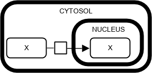</td>
      <td class="af del" style="width:32%">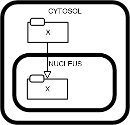</td>
      <!-- <td class="af change" style="width:32%">Not applicable</td> -->
      <td class="er" style="width:32%">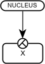</td>
  </tr>
  <tr>
      <td>&nbsp;&nbsp;&nbsp;&nbsp;&nbsp;</td>
      <td>&nbsp;&nbsp;&nbsp;&nbsp;&nbsp;</td>
      <!-- <td></td> -->
      <td>&nbsp;&nbsp;&nbsp;&nbsp;&nbsp;</td>
  </tr>
</table>

### Active transport

<table class="dic">
  <tr>
      <td class="pd" style="width:32%">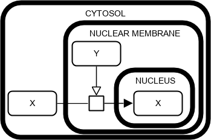</td>
      <td class="af change" style="width:32%">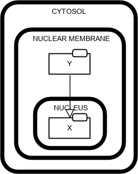</td>
      <td class="er" style="width:32%">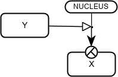</td>
  </tr>
  <tr>
      <td>&nbsp;&nbsp;&nbsp;&nbsp;&nbsp;</td>
      <td>&nbsp;&nbsp;&nbsp;&nbsp;&nbsp;</td>
      <td>&nbsp;&nbsp;&nbsp;&nbsp;&nbsp;</td>
  </tr>
</table>

For the AF expression, the assumption is that X has some activity in the nucleus.

## Functional genomics

Associated GO terms: [GO:0008150 biological_process](http://amigo.geneontology.org/amigo/term/GO:0008150)

<table class="dic">
  <tr>
      <td class="pd" style="width:32%">Not applicable</td>
      <td class="af" style="width:32%">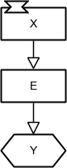</td>
      <td class="er" style="width:32%">Not applicable</td>
  </tr>
  <tr>
      <td></td>
      <td>&nbsp;&nbsp;&nbsp;&nbsp;&nbsp;</td>
      <td></td>
  </tr>
</table>

