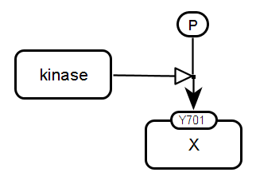
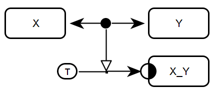
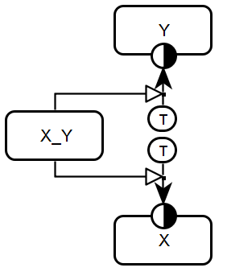
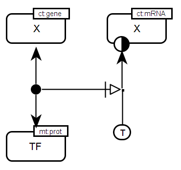
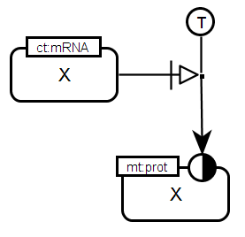
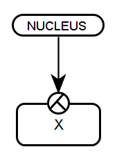
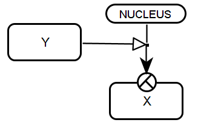

# Entity Relationship Bricks

This page presents a collection of Entity Relationship bricks. 

## Signalling network

<table>
	<tr>
	<td style="width:210px; text-align:center; font-size:90%;"> <a href="/bricks/proteinphosphorylation/ProteinPhosphorylation-ER01.sbgn">SBGN-ML</a> </td>
    <td style="vertical-align: middle; padding-left: 1em;"><strong>Protein phosphorylation.</strong> A kinase entity stimulates the assignment of a phosphorylated state to a target protein entity (X). The assignment is represented using the <i>assignment</i> arc. The phosphate is represented using a <i>variable value</i>. with the label P. The <i>state variable</i> at the target protein indicates the phosphorylation site. </td>
	</tr>
	<tr>
    <td style="width:210px; text-align:center; font-size:90%;"> <a href="/bricks/complexassociation/ComplexFormation-ER01.sbgn">SBGN-ML</a> </td>
    <td style="vertical-align: middle; padding-left: 1em;"><strong>Complex association.</strong> The interaction between the entities X and Y results in the assignment of the value <strong>true</strong> to the state variable <i>existence</i> of the X_Y entity. The complex identity is indicated using the label X_Y.  </td>
    </tr>
   	<tr>
    <td style="width:210px; text-align:center; font-size:90%;"> <a href="/bricks/complexdissociation/ComplexDissociation-ER01.sbgn">SBGN-ML</a> </td>
    <td style="vertical-align: middle; padding-left: 1em;"><strong>Complex dissociation.</strong> The entity X_Y, representing a complex of X and Y, stimulates the assignment of the value <strong>true</strong> to the existence of both two entities X and Y. <strong>True</strong> is indicated using a <i>variable value</i> with the label T. </td>
    </tr>
</table>

## Gene regulatory network

<table>
	<tr>
	<td style="width:210px; text-align:center; font-size:90%;"> <a href="/bricks/generegulation/Transcription-ER01.sbgn">SBGN-ML</a> </td>
    <td style="vertical-align: middle; padding-left: 1em;"><strong>Transcription factor & target gene.</strong> A transcription factor (TF) entity interacts with a target gene entity X. Only if this interaction exists, the existence of the target gene mRNA entity becomes true. <strong>True</strong> is indicated using a <i>variable value</i> with the label T. The connecting arc <i>necessary stimulation</i> is applied to indicate that the interaction of regulator and target is necessary for the transcription to take place. All entities carry units of information with the label indicating the material (mt:prot) or conceptual types (ct:gene, ct:mRNA). </td>
   	</tr>
   	<tr>
   	<td style="width:210px; text-align:center; font-size:90%;"> <a href="/bricks/generegulation/Translation-ER01.sbgn">SBGN-ML</a> </td>
    <td style="vertical-align: middle; padding-left: 1em;"><strong>Translation.</strong> The entity X with the conceptual type "mRNA" essentially stimulates the assignment of the value <strong>true</strong> to the existence of entity X with the material type "protein" (mt:prot). The connecting arc <i>necessary stimulation</i> is applied to indicate that the stimulation by the mRNA is necessary for the translation process to take place. </td>
	</tr>
</table>

## Transport

There are no compartment glyphs in the Entity Relationship language. Therefore the location of entities is represented using the special state variables <i>location</i> and the assigned variable values. 

<table>
	<tr>
	<td style="width:210px; text-align:center; font-size:90%;"> <a href="/bricks/compartmentation/PassiveTransport-ER01.sbgn">SBGN-ML</a> </td>
    <td style="vertical-align: middle; padding-left: 1em;"><strong>Passive transport.</strong> The variable value nucleus is assigned to the entity X. As ER does not represent temporal aspects, this brick does not show the transport of X from one to another compartment but rather shows where the entity X is located in. </td>
   	</tr>
   	<tr>
   	<td style="width:210px; text-align:center; font-size:90%;"> <a href="/bricks/compartmentation/ActiveTransport-ER01.sbgn">SBGN-ML</a> </td>
    <td style="vertical-align: middle; padding-left: 1em;"><strong>Active transport.</strong> The entity Y stimulates the assignment of the value ‘nucleus’ to the state variable <i>location</i> of entity X. The location is indicated using a ‘variable value’ with the label ‘nucleus’. As ER does not represent temporal aspects, this brick does not show the Y-mediated transport of X from one to another compartment. It rather shows the influence of Y on the location of X. </td>
	</tr>	
</table>
