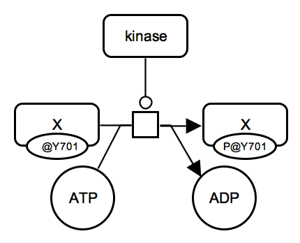
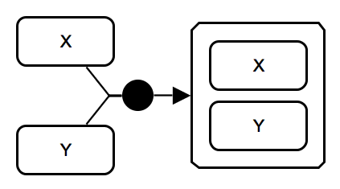
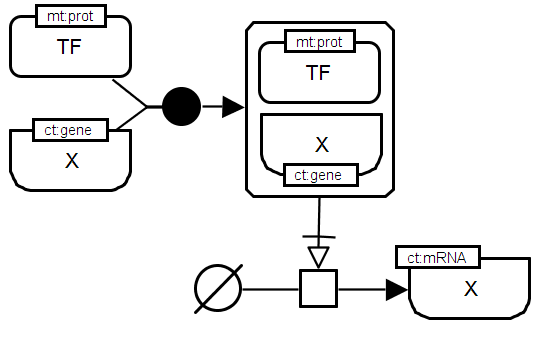
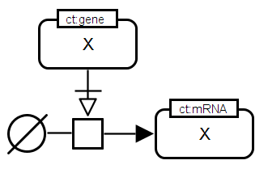
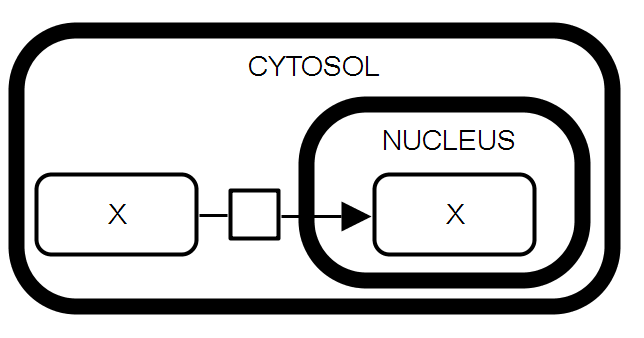
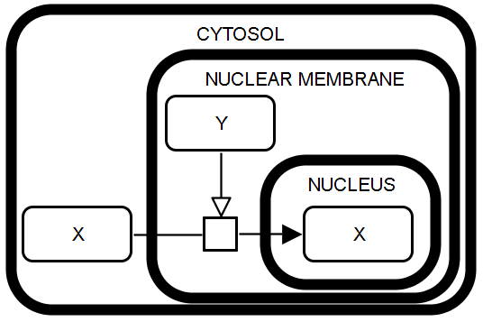

# Process Description Bricks

This page presents a collection of Process Description bricks. Please note that here we show general patterns, more complex cases are possible. For example metabolic reaction can include multiple substrate and products and more than one protein or complex can catalyze a reaction.  

## Metabolic network

    
 <a href="/bricks/reaction/Reaction-PD01-IRR.sbgn">SBGN-ML</a> &ensp; <a href="http://web.newteditor.org/?URL=http://sbgnbricks.github.io/bricks/reaction/Reaction-PD01-IRR.sbgn" target="_blank">Newt</a>

    
<strong>Irreversible reaction.</strong> The substrate and the product of the biochemical reaction are represented by <i>simple chemical</i> glyphs. The substrate is connected to the <i>process</i> glyph by a <i>consumption</i> arc and the product is connected to the process by a <i>production</i> arc.

    
 <a href="/bricks/catalysis/Catalysis-PD01-IRR-1x1.sbgn">SBGN-ML</a> &ensp; <a href="http://web.newteditor.org/?URL=http://sbgnbricks.github.io/bricks/catalysis/Catalysis-PD01-IRR-1x1.sbgn" target="_blank">Newt</a>

    
<strong>Catalysis: irreversible reaction.</strong> The enzyme catalyses an irreversible metabolic process which consumes substrate S1 and produces product P1. The enzyme is a represented as a <i>macromolecule</i> connected to the <i>process</i> glyph by a <i>catalysis</i> arc. The substrate and the product of the biochemical reaction are represented by <i>simple chemical</i> glyphs.

    
 <a href="/bricks/catalysis/Catalysis-PD02-REV-1x1.sbgn">SBGN-ML</a> &ensp; <a href="http://web.newteditor.org/?URL=http://sbgnbricks.github.io/bricks/catalysis/Catalysis-PD02-REV-1x1.sbgn" target="_blank">Newt</a>

    
<strong>Catalysis: reversible reaction</strong>. In case of a reversible reaction, the separation substrate vs. product is relative and each metabolite can be seen an input or an output of this reaction depending on the direction.  
        IMPORTANT: Note that it is not clear which direction is favoured by the catalysis. Instead of presenting it as a reversible process, it is recommended showing direct and reverse reactions, both as irreversible processes.

    
 <a href="/bricks/catalysis/Catalysis-PD01-IRR-2x2.sbgn">SBGN-ML</a> &ensp; <a href="http://web.newteditor.org/?URL=http://sbgnbricks.github.io/bricks/catalysis/Catalysis-PD01-IRR-2x2.sbgn" target="_blank">Newt</a>

    
<strong>Catalysis: multiple substrates and products.</strong> The enzyme catalyses an irreversible metabolic process which consumes two substrates S1 and S2 and produces two products P1 and P2.

    
 <a href="/bricks/inhibition/Inhibition-PD01-enz.sbgn">SBGN-ML</a> &ensp; <a href="http://web.newteditor.org/?URL=http://sbgnbricks.github.io/bricks/inhibition/Inhibition-PD01.sbgn" target="_blank">Newt</a>

    
<strong>Inhibition: irreversible metabolic reaction.</strong> The inhibitor, a proteins shown with a <i>macromolecule</i> glyph, is connected to the <i>process</i> glyph by an <i>inhibition</i> arc.  
      IMPORTANT: Please note that inhibition arcs in Process Descrition go to a <i>process</i> glyph and not directly to a <i>micromolecule</i> or a <i>complex</i>. Direct connections between activities are possible in the Activity Flow language.

## Signalling network

<table>
    <tr>
    <td style="width:210px; text-align:center; font-size:90%;"> <a href="/bricks/proteinphosphorylation/ProteinPhosphorylation-PD01.sbgn">SBGN-ML</a> &ensp; <a href="http://web.newteditor.org/?URL=http://sbgnbricks.github.io/bricks/proteinphosphorylation/ProteinPhosphorylation-PD01.sbgn" target="_blank">Newt</a></td>
    <td style="vertical-align: middle; padding-left: 1em;"><strong>Protein phosphorylation.</strong> A kinase protein catalyzes an irreversible reaction which consumes unphosphorylated protein X and ATP and produces phosphorylated protein X and ADP. Phosphorylated state is shown by "P" in the auxiliary glyph. All proteins involved are represented by <i>macromolecule</i> glyphs.</td>
    </tr>
    <tr>
    <td style="width:210px; text-align:center; font-size:90%;"> <a href="/bricks/proteinphosphorylation/ProteinPhosphorylation-PD01-Y.sbgn">SBGN-ML</a> &ensp; <a href="http://web.newteditor.org/?URL=http://sbgnbricks.github.io/bricks/proteinphosphorylation/ProteinPhosphorylation-PD01-Y.sbgn" target="_blank">Newt</a></td>
    <td style="vertical-align: middle; padding-left: 1em;"><strong>Protein phosphorylation.</strong> A kinase protein catalyzes an irreversible reaction which consumes unphosphorylated protein X and ATP and produces phosphorylated protein X and ADP. All proteins involved are represented by <i>macromolecule</i> glyphs. <i>State variable</i> auxiliary glyphs are used to indicate the phosphorylation state: "P@Y701" means "phosphorylated at tyrosine 701" (one-letter amino acid code). Instead of empty state, "@Y701" without "P" can be used to indicate the position.</td>
    </tr>
    <tr>
    <td style="width:210px; text-align:center; font-size:90%;"> <a href="/bricks/proteinphosphorylation/ProteinPhosphorylation-PD01-2x2.sbgn">SBGN-ML</a> &ensp; <a href="http://web.newteditor.org/?URL=http://sbgnbricks.github.io/bricks/proteinphosphorylation/ProteinPhosphorylation-PD01-2x2.sbgn" target="_blank">Newt</a></td>
    <td style="vertical-align: middle; padding-left: 1em;"><strong>Protein phosphorylation.</strong> A kinase protein catalyzes an irreversible reaction which consumes unphosphorylated protein X and ATP and produces phosphorylated protein X and ADP. All proteins involved are represented by <i>macromolecule</i> glyphs. <i>State variable</i> auxiliary glyphs are used to indicate the phosphorylation state: "P@Y701" means "phosphorylated at tyrosine 701" (one-letter amino acid code). Instead of empty state, "@Y701" without "P" can be used to indicate the position. ATP and ADP are represented as <i>simple chemicals</i>.</td>
    </tr>
    <tr>
    <td style="width:210px; text-align:center; vertical-align: middle; font-size:90%;"> <a href="/bricks/oligomerisation/Homodimerisation-PD01.sbgn">SBGN-ML</a> &ensp; <a href="http://web.newteditor.org/?URL=http://sbgnbricks.github.io/bricks/oligomerisation/Homodimerisation-PD01.sbgn" target="_blank">Newt</a></td>
    <td style="vertical-align: middle; padding-left: 1em;"><strong>Oligomerisation.</strong> The process of homodimer formation consumes 2 <i>micromolecules</i> X and produces <i>multimer</i> X. The number - 2 monomers - is provided in the <i>unit of information</i>: "N:2". The <i>consumption arc</i> has <i>cardinality</i> element showing the number of molecules consumed. 
        
IMPORTANT: While the <i>association</i> glyph is used here, users can choose to use the generic <i>process</i> glyph.
</td>
    </tr>
    <tr>
    <td style="width:210px; text-align:center; vertical-align: middle; font-size:90%;"> <a href="/bricks/complexassociation/ComplexFormation-PD01.sbgn">SBGN-ML</a> &ensp; <a href="http://web.newteditor.org/?URL=http://sbgnbricks.github.io/bricks/complexassociation/ComplexFormation-PD01.sbgn" target="_blank">Newt</a></td>
    <td style="vertical-align: middle; padding-left: 1em;"><strong>Complex association.</strong> The process of heterodimer formation consumes 2 <i>micromolecules</i> X and Y, and produces <i>complex</i> X-Y.  
        
IMPORTANT: While the <i>association</i> glyph is used here, users can choose to use the generic <i>process</i> glyph.
</td>
    </tr>
    <tr>
    <td style="width:210px; text-align:center; vertical-align: middle; font-size:90%;"> <a href="/bricks/complexdissociation/ComplexDissociation-PD01.sbgn">SBGN-ML</a> &ensp; <a href="http://web.newteditor.org/?URL=http://sbgnbricks.github.io/bricks/complexdissociation/ComplexDissociation-PD01.sbgn" target="_blank">Newt</a></td>
    <td style="vertical-align: middle; padding-left: 1em;"><strong>Complex dissociation.</strong> A complex of two <i>macromolecule</i> entities X and Y breaks down into <i>macromolecules</i> X and Y. 
        
IMPORTANT: While the <i>dissociation</i> glyph is used here, users can choose to use the generic <i>process</i> glyph.
</td>
    </tr>
</table>

## Gene regulatory network

<table>
	<tr>
	<td style="width:210px; text-align:center; font-size:90%;"> <a href="/bricks/generegulation/Transcription-PD01.sbgn">SBGN-ML</a> &ensp; <a href="http://web.newteditor.org/?URL=http://sbgnbricks.github.io/bricks/generegulation/Transcription-PD01.sbgn" target="_blank">Newt</a> </td>
    <td style="vertical-align: middle; padding-left: 1em;"><strong>Direct regulation of a target gene by a transcription factor.</strong> The transcription factor (TF) builds a complex with the target gene promoter. The TF protein is a <i>macromolecule</i> with the material type "protein" (mt:prot) whereas the gene promoter is given as a <i>nucleic acid feature</i> with the conceptual type "gene" (ct:gene). The complex of both regulator and target gene triggers the "process" of transcription. The connecting arc <i>necessary stimulation</i> indicates that the stimulation by the regulator-target-complex is necessary for the transcription process to take place. The target gene messenger as a product of the transcription process is represented by a <i>nucleic acid feature</i> with the conceptual type "mRNA" (ct:mRNA). The <i>unspecified source</i> symbol is used to represent the large number of substrates of a transcription process (e.g. trinucleotides). </td>
   	</tr>
	<tr>
	<td style="width:210px; text-align:center; font-size:90%;"> <a href="/bricks/generegulation/Translation-PD01.sbgn">SBGN-ML</a> &ensp; <a href="http://web.newteditor.org/?URL=http://sbgnbricks.github.io/bricks/generegulation/Translation-PD01.sbgn" target="_blank">Newt</a> </td>
    <td style="vertical-align: middle; padding-left: 1em;"><strong>Translation.</strong> The mRNA of gene X stimulates the translation process leading to the production of the corresponding protein X. The transcript is given as a <i>nucleic acid feature</i> with the conceptual type "mRNA" (ct:mRNA) whereas the corresponding protein is a <i>macromolecule</i> of the material type "protein" (mt:prot). The connecting arc <i>necessary stimulation</i> is applied to indicate that the stimulation by the mRNA is necessary for the translation process to take place. The <i>unspecified source</i> symbol is used to represent the large number of substrates of the translation process (i.e. amino acids).  </td>
   	</tr>
</table>

## Transport

<table>
	<tr>
	<td style="width:210px; text-align:center; font-size:90%;"> <a href="/bricks/compartmentation/PassiveTransport-PD01.sbgn">SBGN-ML</a> &ensp; <a href="http://web.newteditor.org/?URL=http://sbgnbricks.github.io/bricks/compartmentation/PassiveTransport-PD01.sbgn" target="_blank">Newt</a> </td>
    <td style="vertical-align: middle; padding-left: 1em;"><strong>Passive transport.</strong> The <i>macromolecule</i> X in the cytosol serves as the substrate of a process leading to the production of the macromolecule X in the nucleus. This process describes the passive transport of X from one compartment to the other. The two macromolecules X do not carry the clone marker because the containing compartment is part of their identity. </td>
   	</tr>
   	<tr>
   	<td style="width:210px; text-align:center; font-size:90%;"> <a href="/bricks/compartmentation/ActiveTransport-PD01.sbgn">SBGN-ML</a> &ensp; <a href="http://web.newteditor.org/?URL=http://sbgnbricks.github.io/bricks/compartmentation/ActiveTransport-PD01.sbgn" target="_blank">Newt</a> </td>
    <td style="vertical-align: middle; padding-left: 1em;"><strong>Active transport.</strong> The <i>macromolecule</i> X in the cytosol serves as the substrate of a process leading to the production of the macromolecule X in the nucleus. This process is stimulated by the <i>macromolecule</i> Y which is located within the nuclear membrane and represents the transporter protein. Cytosolic, membrane and nuclear localization are represented using the <i>compartment</i> glyph with the corresponding label. </td>
	</tr>	
</table>
