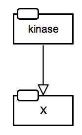
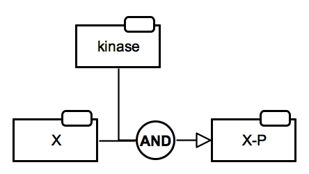

# PD2AF Converter

[PD2AF converter](http://pd2af.me/) is an open-source application designed to enable communication between the Process Description and the Activity Flow languages of the SBGN standard. The tool is built on the previously published template-based translation from PD to AF (Vogt et al., 2013, [doi: 10.1186/1752-0509-7-115](https://doi.org/10.1186/1752-0509-7-115)) available as part of the SBGN-ED addon of the VANTED editor. The purpose of the new tool is to translate PD to AF in such a way so it is possible to can avoid using complexes in the resulting AF version and therefore be as close as possible to manually designed AF diagrams and the corresponding logical modles. The coverter uses the concept of the SBGN Bricks and additionally takes into account patterns of various types of inhibition. The code is written in Lisp.

## Availability

Online conversion (daily updates): [http://pd2af.me/](http://pd2af.me/)  
Online conversion (stable version): [http://pd2af.org/](http://pd2af.org/)  
Github: [https://github.com/prozion/pd2af](https://github.com/prozion/pd2af)  

<!-- The translation fuctuionality is implemented in Newt Editor.-->

## Contributors

Denis Shirshov, European Institute for Systems Biology and Medicine, Lyon, France  
Alexander Mazein, European Institute for Systems Biology and Medicine, Lyon, France  
Anatoly Sorokin, Institute of Cell Biophysics, Russian Academy of Science, Pushchino, Russia  
Irina Balaur, European Institute for Systems Biology and Medicine, Lyon, France  
Vasundra Touré, Norwegian University of Science and Technology, Trondheim, Norway  
<!--Ugur Dogrusoz, Bilkent University, Ankara, Turkey  -->
Johann Pellet, European Institute for Systems Biology and Medicine, Lyon, France  
Charles Auffray, European Institute for Systems Biology and Medicine, Lyon, France  

## PD2AF 1.0

The implemented logic is based on the work by Vogt and coauthors (Vogt et al., 2013, [doi: 10.1186/1752-0509-7-115](https://doi.org/10.1186/1752-0509-7-115)) and further developed to minimise the number of complexes in AF version and to introduce pattern recongition fuctionalities.

What is new in PD2AF 1.0:
1. The code is writen from scratch in Lisp programming language and made easily accessible on [Github](https://github.com/prozion/pd2af).
1. Added pattern recognition for removing "intermediate" complexes.
1. Added pattern recognition for some types of inhibition shown in details without using the _inhibition_ arc.

## Development plan

The development is planned in a stepwise manner and assumes the following milestones.

#### PD2AF Milestone #1 Basic - "Enhanced" version - Automatic

#### PD2AF Milestone #2 Intermediate - "Adviser" version - Semi-automatic

#### PD2AF Milestone #3 Advanced - "Informed guess" version - Automatic

## Translation rules

### Protein activation by phosphorylation

<table>
    <tr style="font-size:90%;">
    <td style="width:220px; text-align:center; font-size:90%;"> <a href="/bricks/proteinphosphorylation/ProteinPhosphorylation-PD01.02-Y.sbgn">SBGN-ML</a> &ensp; <a href="http://web.newteditor.org/?URL=http://sbgnbricks.github.io/bricks/proteinphosphorylation/ProteinPhosphorylation-PD01.02-Y.sbgn" target="_blank">Newt</a></td>
    <td style="width:220px; text-align:center; font-size:90%;"> <a href="/bricks/proteinphosphorylation/ProteinPhosphorylation-AF01.01.sbgn">SBGN-ML</a> &ensp; <a href="http://web.newteditor.org/?URL=http://sbgnbricks.github.io/bricks/proteinphosphorylation/ProteinPhosphorylation-AF01.01.sbgn" target="_blank">Newt</a></td>
    <td style="vertical-align: middle; padding-left: 1em;">This translation is conditional. It assumes that 1) the unphosphorylated state is not active, i.e. there are no outgoing regulatory arcs, 2) the resulting state is active towards another process, i.e. there are outgoing regulatory arcs or there could be (might not be shown on the diagram).</td>
    </tr>
</table>

<table>
    <tr style="font-size:90%;">
    <td style="width:220px; text-align:center; font-size:90%;"> <a href="/bricks/proteinphosphorylation/ProteinPhosphorylation-PD01.02-Y.sbgn">SBGN-ML</a> &ensp; <a href="http://web.newteditor.org/?URL=http://sbgnbricks.github.io/bricks/proteinphosphorylation/ProteinPhosphorylation-PD01.02-Y.sbgn" target="_blank">Newt</a></td>
    <td style="width:220px; text-align:center; font-size:90%;"> <a href="/pd2af/ProteinPhosphorylation-PD01.02-PD2AF02.sbgn">SBGN-ML</a> &ensp; <a href="http://web.newteditor.org/?URL=http://sbgnbricks.github.io/pd2af/ProteinPhosphorylation-PD01.02-PD2AF02.sbgn" target="_blank">Newt</a></td>
    <td style="vertical-align: middle; padding-left: 1em;">Translation of the case when it is necessary to show two activities of the same protein, i.e. there are outgoing regulatory arcs from both states in PD. An example case is the  <a href="http://metabolismregulation.org/glycolysis/" target="_blank">phosphorylation of bifuntional enzyme PFK by PKA</a>.</td>
    </tr>
</table>

